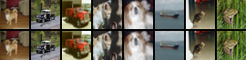

# On Memorization in Diffusion Models
Code for the paper [On Memorization in Diffusion Models]().

## Environments

* We run all our experiments on A100 GPUs

* 64-bit Python 3.8 and PyTorch 1.13.

* Python libraries: See [environment.yml](./environment.yml) for exact library dependencies. You can use the following commands with Miniconda3 to create and activate your Python environment:
  - `conda env create -f environment.yml -n edm`
  - `conda activate edm`

## Datasets

We run our experiments on the CIFAR-10 and ImageNet datasets.

[CIFAR-10](https://www.cs.toronto.edu/~kriz/cifar.html) can be downloaded and saved to `datasets/cifar10` by the following commands:
```
mkdir datasets
mkdir datasets/cifar10
wget -P datasets/cifar10 https://www.cs.toronto.edu/~kriz/cifar-10-python.tar.gz
```

Prepare the full training dataset of CIFAR-10 with $\mathcal{D}=50\text{k}$:
```
python dataset_tool.py --source=datasets/cifar10/cifar-10-python.tar.gz --dest=datasets/cifar10/cifar10-train.zip
```

To download ImageNet, please refer to [ImageNet Object Localization Challenge](https://www.kaggle.com/competitions/imagenet-object-localization-challenge/data) and save it to `datasets/imagenet`. 

## Optimal Diffusion Model
Firstly, we compare the generated images by the theoretical optimum and state-of-the-art diffusion model (EDM). The experiments are run on a single A100 GPU.

Generate 50k images by the theoretical optimum:
```
torchrun --standalone --nproc_per_node=1 generate_optim.py --outdir=fid-tmp-optim --seeds=0-49999 --subdirs --network=datasets/cifar10/cifar10-train.zip
```

Visualize these generated images (top row) and their $\ell_2$-nearest training samples in $\mathcal{D}$ (bottom row):

<p align="center">

</p>

Generate 50k images by EDM (unconditional, vp):
```
torchrun --standalone --nproc_per_node=1 generate_edm.py --outdir=fid-tmp-edm --seeds=0-49999 --subdirs --network=https://nvlabs-fi-cdn.nvidia.com/edm/pretrained/edm-cifar10-32x32-uncond-vp.pkl
```
`edm-cifar10-32x32-uncond-vp.pkl` is derived from the [pre-trained](https://github.com/NVlabs/edm) models by Tero Karras, Miika Aittala, Timo Aila, Samuli Laine. This model is licensed under the [Creative Commons Attribution-NonCommercial-ShareAlike 4.0 International License](https://creativecommons.org/licenses/by-nc-sa/4.0/).

Visualize these generated images (top row) and their $\ell_2$-nearest training samples in $\mathcal{D}$ (bottom row):


<p align="center">

</p>

## Empirical Study
The basic procedure to evaluate the contribution of factor on memorization in diffusion models is as follows:

**Step I**: Sample a training dataset with different sizes $|\mathcal{D}|$. The codes are in `dataset_utils`, which will be introduced later. The sampled dataset will be saved to `$data_path`.

**Step II**: Train a diffusion model on the training data.

All of our experiments related to model training are run on 8 A100 GPUs through DDP with multi-node training. The basic command is
```
torchrun --nproc_per_node 1 \
         --nnodes $WORLD_SIZE \
         --node_rank $RANK \
         --master_addr $MASTER_ADDR \
         --master_port $MASTER_PORT \
         train.py --outdir=$savedir --argument=$argument
```

Alternatively, you can use the following command to support DDP with single-node training
```
torchrun --standalone --nproc_per_node=8 train.py --outdir=$savedir --argument=$argument
```

We suggest to provide a unique `$savedir` for each experiment. `$argument` includes all hyper-parameters.

**Step III**: Evaluate the snapshots of this trained diffusion model and report the highest memorization ratio.

```
torchrun --standalone --nproc_per_node=$num_gpu mem_ratio.py --expdir=$outdir --knn-ref=$data_path --log=$outdir/mem_traj.log --seeds=0-9999 --subdirs --batch=512
```

`$outdir` refers to the folder including all model snapshots.


**Step IV**: Modify the value of factor, and then repeat Step I-III and find the Effective Model Memorization (EMM).

We provide all the scripts to reproduce our experimental results in the paper in following subsections.


* Data distribution $P$: refer to `scripts/data_distribution.md`.

* Model configuration $\mathcal{M}$: refer to `scripts/model_config.md`.

* Training procedure $\mathcal{T}$: refer to `scripts/train_procedure.md`.

* Unconditional v.s. conditional generation: refer to `scripts/conditional.md`.

<!-- Our following experiments are run on 8 A100 GPUs, our provided code is through DDP with multi-node training, whose format is
```
torchrun --nproc_per_node 1 \
         --nnodes $WORLD_SIZE \
         --node_rank $RANK \
         --master_addr $MASTER_ADDR \
         --master_port $MASTER_PORT \
         train.py --parse=$parse
```

Alternatively, you can change it as follows to supprot DDP with single-node training
```
torchrun --standalone --nproc_per_node=8 train.py --parse=$parse
```
### Motivations
1. To reproduce our experiments in Figure 1(c), here is an example
```
bash scripts/run_fig1_cd.sh 10000 fig1_c/size10000 200
```

2. To reproduce our experiments in Figure 1(d), here is an example
```
bash scripts/run_fig1_cd.sh 1000 fig1_d/size1000 2000
```

### Data distribution
To reproduce our experiments of data dimension in Figure 2(a), here is an example
```
bash scripts/run_fig2_dim.sh 5000 32 fig2_a/size5000_res32 16
bash scripts/run_fig2_dim.sh 5000 16 fig2_a/size5000_res16 8
bash scripts/run_fig2_dim.sh 5000 8 fig2_a/size5000_res8 4
```

To reproduce our experiments of data inter-diversity in Figure 2(b), here is an example
```
bash scripts/run_fig2_inter.sh 2000 5 fig2_b/size2000_class5
```

To reproduce our experiments of data intra-diversity in Figure 2(c), here is an example
```
bash scripts/run_fig2_intra.sh 2000 0.5 fig2_c/size2000_alpha0.5
```


### Model configuration: model width/depth/time embedding
To reproduce our experiments in Figure 3, here is an example, please change the arguments to reproduce all experiments
```
bash scripts/run_fig3_model.sh 2000 fig3/size2000_2_128_positional 2 128 positional
```
or 

```
bash scripts/run_fig3_model.sh 1000 fig3/size1000_4_128_fourier 4 128 fourier
```

### Model configuration: skip connections
To reproduce our experiments in Figure 4, here is an example for DDPM++
```
bash scripts/run_fig4_skip.sh 1000 fig4/size1000_ddpmpp_skip1,1,1,1,1,1,1,1,1 vp ddpmpp positional 1,1,1,1,1,1,1,1,1
```

Here is another example for NCSN++
```
bash scripts/run_fig4_skip.sh 1000 fig4/size1000_ncsnpp_skip0,1,1,1,1,1,1,1,1 ve ncsnpp fourier 0,1,1,1,1,1,1,1,1
```

### Training procedure
To reproduce our experiments in Table 1, here is an example
```
bash scripts/run_table1_2.sh 2000 tbl1/size2000_batch256 256 1e-4 0.0
```

To reproduce our experiments in Table 2, here is an example
```
bash scripts/run_table1_2.sh 2000 tbl2/size2000_decay1e-4 512 2e-4 1e-4
```

To reproduce our experiments in Table 3, here is an example
```
bash scripts/run_table3.sh 2000 tbl3/size2000_ema0.999 0.999
```

### Unconditional v.s. Conditional
To reproduce our experiments for conditional diffusion models with true labels
```
bash scripts/run_fig5_cond.sh 2000 fig5/size2000_true_cond
```

To reproduce our experiments for conditional diffusion models with random labels
```
bash scripts/run_fig5_random.sh 2000 50 fig5/size2000_random_cond50
```

To reproduce our experiments for conditional diffusion models with unique labels
```
bash scripts/run_fig5_unique.sh 2000 fig5/size2000_unique
```

To reproduce our experiments for conditional EDM with unique labels
```
bash scripts/run_fig5_edm.sh fig5/size50k_edm_unique
``` -->


## References
If you find the code useful for your research, please consider citing our paper


## Acknowledgements
Our codes are modified based on the [official implementation of EDM](https://github.com/NVlabs/edm). 