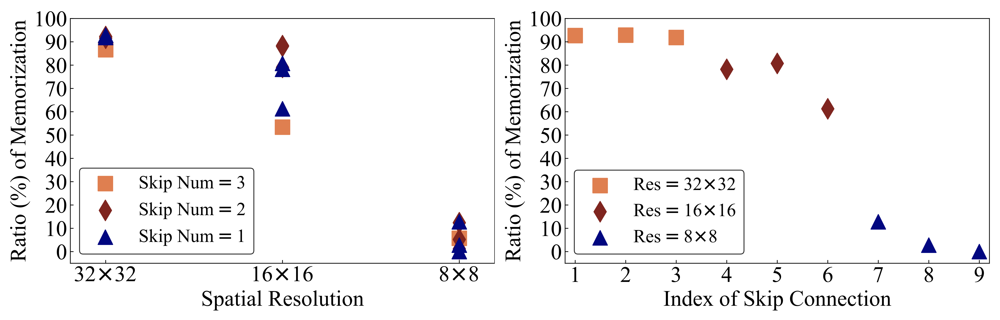
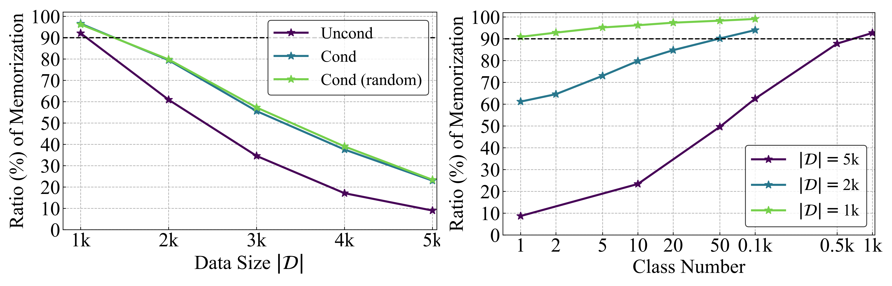
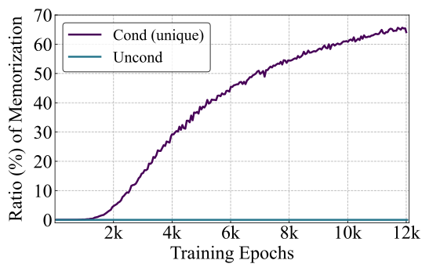

# On Memorization in Diffusion Models
Code for the paper [On Memorization in Diffusion Models]().

## Environments

* We run all our experiments on A100 GPUs

* Python 3.8 and PyTorch 1.13 and CUDA 11.8.

* Run the following commands to install python libraries:
  - `pip install -r requirements.txt`

## Datasets

We run our experiments on the CIFAR-10 and ImageNet datasets.

[CIFAR-10](https://www.cs.toronto.edu/~kriz/cifar.html) can be downloaded and saved to `datasets/cifar10` by the following commands:
```
mkdir datasets
mkdir datasets/cifar10
wget -P datasets/cifar10 https://www.cs.toronto.edu/~kriz/cifar-10-python.tar.gz
```

Prepare the full training dataset of CIFAR-10 with $|\mathcal{D}|=50\text{k}$:
```
python dataset_tool.py --source=datasets/cifar10/cifar-10-python.tar.gz --dest=datasets/cifar10/cifar10-train.zip
```

To download ImageNet, please refer to [ImageNet Object Localization Challenge](https://www.kaggle.com/competitions/imagenet-object-localization-challenge/data) and save it to `datasets/imagenet`. 

## Optimal Diffusion Model
Firstly, we compare the generated images by the theoretical optimum and state-of-the-art diffusion model (EDM). The experiments are run on a single A100 GPU.

We include the implementations of the theoretical optimum in `training/optim.py`. We use following command to generate images by this theoretical optimum:
```
torchrun --standalone --nproc_per_node=1 generate_optim.py --outdir=fid-tmp-optim --seeds=0-49999 --subdirs --network=datasets/cifar10/cifar10-train.zip
```

## Empirical Study
The basic procedure to evaluate the contribution of factor on memorization in diffusion models is as follows:

**Step I**: Sample a training dataset with different sizes $|\mathcal{D}|$. The codes are in `dataset_utils`, which will be introduced later. The sampled dataset will be saved to `$data_path`.

**Step II**: Train a diffusion model on the training data.

All of our experiments related to model training are run on 8 A100 GPUs through DDP with multi-node training. The basic command is
```
torchrun --nproc_per_node 1 \
         --nnodes $WORLD_SIZE \
         --node_rank $RANK \
         --master_addr $MASTER_ADDR \
         --master_port $MASTER_PORT \
         train.py --outdir=$savedir --argument=$argument
```

Alternatively, you can use the following command to support DDP with single-node training
```
torchrun --standalone --nproc_per_node=8 train.py --outdir=$savedir --argument=$argument
```

We suggest to provide a unique `$savedir` for each experiment. `$argument` includes all hyper-parameters.

**Step III**: Evaluate the snapshots of this trained diffusion model and report the highest memorization ratio.

```
torchrun --standalone --nproc_per_node=$num_gpu mem_ratio.py --expdir=$outdir --knn-ref=$data_path --log=$outdir/mem_traj.log --seeds=0-9999 --subdirs --batch=512
```

`$outdir` refers to the folder including all model snapshots.


**Step IV**: Modify the value of factor, and then repeat Step I-III and find the Effective Model Memorization (EMM).

We provide all the scripts to reproduce our experimental results in the paper in following subsections.


* Data distribution $P$: refer to `scripts/data_distribution.md`. Here we highlight that data dimension has significant contributions to memorization in diffusion models. 

<p align="center">

</p>


* Model configuration $\mathcal{M}$: refer to `scripts/model_config.md`. Here we highlight that skip connections on higher resolutions play important roles on memorization.

<p align="center">

</p>

* Training procedure $\mathcal{T}$: refer to `scripts/train_procedure.md`.

* Unconditional v.s. conditional generation: refer to `scripts/conditional.md`. Here we highlight that random labels as conditions can trigger the memorization of diffusion models.

<p align="center">

</p>

Finally, we highlight that conditional EDM with unique labels as conditions can largely memorize training data with $|\mathcal{D}|=50\text{k}$ compared to unconditional EDM.

<p align="center">

</p>

## References
If you find the code useful for your research, please consider citing our paper


## Acknowledgements
Our codes are modified based on the [official implementation of EDM](https://github.com/NVlabs/edm). 